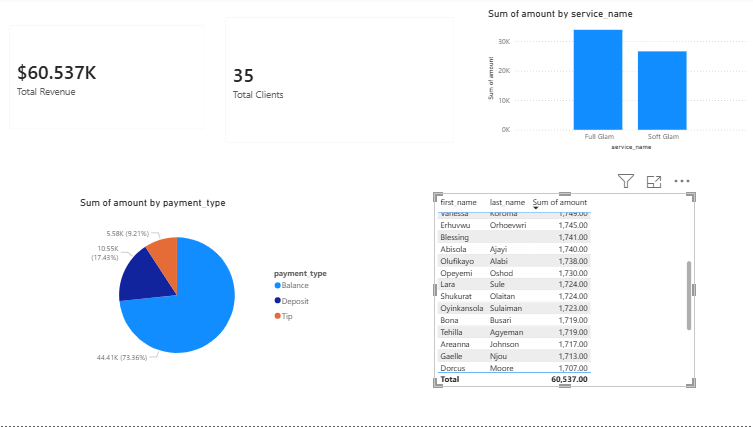

## Dashboard Preview

### Overview Dashboard

# Makeup Booking Analytics Dashboard

## Project Overview
This project is an end-to-end business analytics dashboard built using SQL Server and Power BI. It analyzes a makeup booking system to evaluate client behavior, revenue performance, service demand, and overall business profitability.

The goal is to transform raw booking and payment data into actionable insights that support better business decisions.

---

## Tools & Technologies
- SQL Server – Data extraction, cleaning, and analysis
- Power BI – Data visualization and dashboard development
- DAX – KPI calculations and measures
- CSV exports – Data handling and preparation

---

## Business Questions Answered
- Who are the highest-value clients?
- Which services generate the most revenue?
- How does revenue vary across payment methods?
- What is the overall business performance?
- Which services are most profitable?

---

## Dashboard Features
- Total Revenue and Client KPIs
- Appointment and booking analysis
- Revenue breakdown by service type
- Payment method distribution
- Top spending clients analysis
- Service profitability insights

---

## Key Insights
- Identified top revenue-generating clients
- Highlighted most profitable services
- Analyzed payment trends across customers
- Provided visibility into business performance patterns

---

## Project Objective
To demonstrate how data analytics can be used to improve decision-making in a service-based business by identifying revenue drivers and customer behavior patterns.

---

## Skills Demonstrated
- Data analysis using SQL
- Business intelligence reporting
- KPI development using DAX
- Dashboard design and storytelling
- Data-driven decision making
